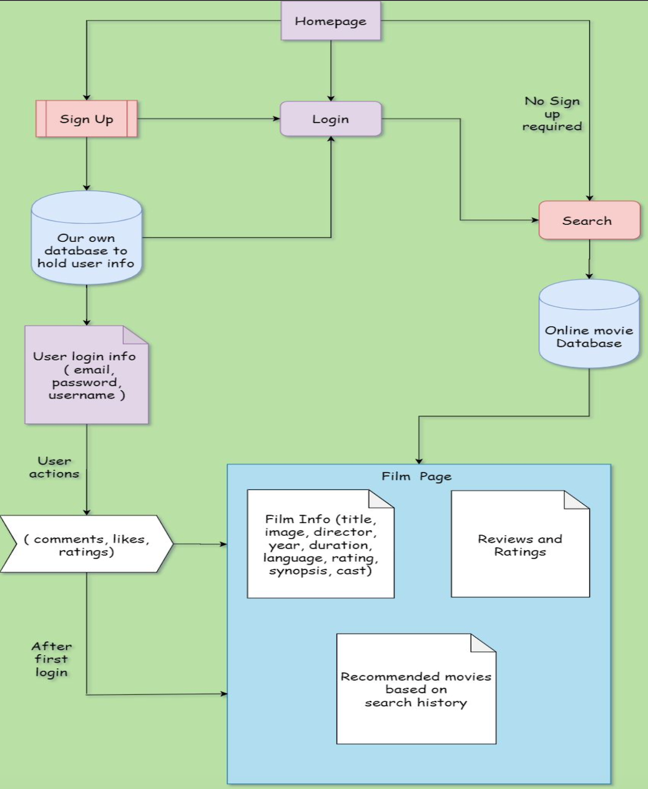

# CMPE 195B - Senior Design Project II 

## 👥 Team

This project was developed as part of B.S. in Software Engineering degree for the CMPE-195B Senior Design course at San Jose State University, under the guidance of [Professor Jahan Ghofraniha](https://www.linkedin.com/in/jahan-ghofraniha-7a09143/).

Team members:
- [Rohan Patel](https://www.linkedin.com/in/rohanbhadreshpatel/)
- [Himmat Singh](https://www.linkedin.com/in/himmat-singh-11921a133/)
- [Harmanbir Ghotra](https://www.linkedin.com/in/harman-bir-singh-ghotra-299b58165/)
- [Inderjit Singh](https://www.linkedin.com/in/inderjitsingh1/)

# MovInfo - Your Movie Review Companion 🎬

MovInfo is an Android mobile application for movie lovers who want to make informed decisions about what to watch! Get all the information you need in one place - search for movies, read reviews, watch trailers, and get personalized recommendations tailored to your tastes. Say goodbye to app hopping and hello to a seamless movie discovery experience.

## 📺 Demo Video

Check out this short video demonstration to see MovInfo in action:

[](https://youtu.be/aunLLGuOHco)

## 🌟 Features

- 🔍 Search an extensive database of movies from Hollywood and around the world
- 📃 Read reviews from critics and fellow movie buffs to get a well-rounded opinion
- 🎞️ Watch exciting trailers to get a sneak peek at the movie's style and story
- 🧠 Get intelligent movie suggestions based on your unique watch history and preferences
- 🌍 Explore movies from various countries and in different languages

## 🏗️ Architecture

MovInfo follows a clean Model-View-ViewModel (MVVM) architecture for modular, testable, and maintainable code. The key components are:

- 💾 **Model**: Fetches movie data from TMDb API and local MongoDB, encapsulates business logic
- 📱 **View**: Renders the UI, receives user interactions, observes changes in the ViewModel
- 🧠 **ViewModel**: Mediates between the View and Model, exposes observable movie data streams

The application is based on the following patterns and architectures:
- Single Activity
- Model-View-ViewModel (MVVM)
- Single Source of Truth (SSOT)
- Repository Pattern (Local Cache & Remote Data Source)

<p align="center">
  
</p>

## 🛠️ Technologies

- [Android Studio](https://developer.android.com/studio) - The official IDE for Android app development
- [Kotlin](https://kotlinlang.org/) - A modern, concise, and safe programming language
- [MongoDB](https://www.mongodb.com/) - A flexible NoSQL database for storing user data
- [TMDb API](https://www.themoviedb.org/) - The Movie Database API for fetching movie metadata
- [Marvel App](https://marvelapp.com/) - A powerful design & prototyping tool

Utilizes a number of open source projects to work properly:
- [Dagger2](https://github.com/google/dagger) - A fast dependency injection framework
- [Retrofit](https://square.github.io/retrofit/) - A type-safe HTTP client for making API calls
- [Glide](https://github.com/bumptech/glide) - An image loading and caching library for smooth scrolling  
- [Lottie](https://github.com/airbnb/lottie-android) - A library for parsing Adobe After Effects animations
- [Taiga](https://www.taiga.io/) - An Agile project management platform

## 🏁 Getting Started

### Prerequisites

- Android Studio 4.2 or higher
- Android SDK 29 or higher
- Gradle 6.x+
- Git 3.x+

### Installation

1. Clone this repository and import into Android Studio
   ```sh
   git clone https://github.com/rohanbhadreshpatel/MovInfo.git
   ```
2. Configure your [TMDb API](https://developers.themoviedb.org/3/getting-started/introduction) and [MongoDB](https://www.mongodb.com/docs/drivers/android/) credentials
3. Build and run the project on an Android 5.0+ (Lollipop) device or emulator

### Running the App

1. Download [Android Studio](https://developer.android.com/studio) and follow the installation wizard
2. Clone or download the [MovInfo project](https://github.com/rohanbhadreshpatel/MovInfo)
3. Open Android Studio, click on "Open an Existing Project", and select the MovInfo folder
4. Wait for the project to build and resolve dependencies
5. Create a new Android Virtual Device (AVD) by clicking "Tools" > "AVD Manager"
   - If the AVD Manager doesn't open, restart Android Studio and try again
   - Click "Create Virtual Device", select a phone device (e.g., Pixel 2), and click "Next"
   - Download the "R" (Android 11) system image and select it, then click "Next" and "Finish"
6. In Android Studio, click the "Run" button (green triangle) or press `Shift+F10`
7. Select the AVD you created and click "OK"
8. Once the emulator is running, MovInfo will launch automatically
9. Use your mouse to interact with the app (left-click and drag to scroll and swipe)

## 💡 Development Process

Our team of developers followed Agile methodologies with Taiga to iteratively design, develop, and test MovInfo:

1. 🔍 Requirements gathering and research
2. 🎨 UI prototyping and architecture design
3. 👨‍💻 Implementation of front-end, back-end, and integration
4. 📝 Documentation and code cleanup

## ✅ Todos
To ensure MovInfo is robust, performant and delightful to use:

- [ ] Unit Testing of individual components with JUnit
- [ ] Integration testing of front-end and back-end
- [ ] End-to-end testing of complete user flows
- [ ] Performance testing for speed, stability and scalability under high load
- [ ] Add transition animations
- [ ] Clean code

## 🙏 Acknowledgments

We would like to express our gratitude to the following individuals and resources for their valuable contributions and support throughout the development of MovInfo:

- Dr. Jahan Ghofraniha, our advisor, for guiding us from the beginning and sharing his wisdom, knowledge, and experience.
- Our friends and family for participating in our research by filling out the Google Form.
- Professor Wencen Wu, our course instructor, for her guidance and helping us complete the project.
- [Android Developers Documentation](https://developer.android.com/docs) for comprehensive guides and tutorials.
- [The Movie Database (TMDb) API](https://www.themoviedb.org/) for providing the movie data.
- [README Template](https://github.com/othneildrew/Best-README-Template) for inspiration and guidance on creating a well-structured README.
